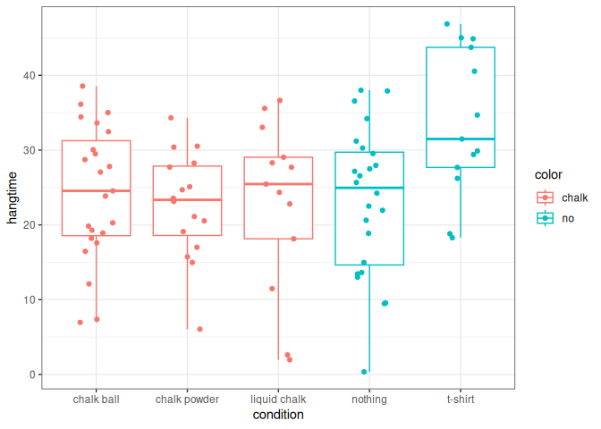

The Effect of Chalk on Hangtime
================
21 January, 2026

This manuscript uses the Workflow for Open Reproducible Code in Science
(Van Lissa et al. 2021) to ensure reproducibility and transparency. All
code <!--and data--> are available at <demo_metarep>.

This is an example of a non-essential citation (Van Lissa et al. 2021).
If you change the rendering function to `worcs::cite_essential`, it will
be removed.

<!--The function below inserts a notification if the manuscript is knit using synthetic data. Make sure to insert it after load_data().-->

## Results

``` r
contrasts(df$condition) <- matrix(c(
  2/3,  1/2,  1, 0,   
  2/3,  1/2, -1, 0,
  2/3, -1,    0, 0,
  -1,   0,    0, -1,
  -1,   0,    0, 1), nrow = 5, byrow = TRUE)
colnames(contrasts(df$condition)) <- c("noVchalk", "liquidVsolid", "powderVball", "nothingVshirt")
res <- lm(hangtime ~ condition, data = df)
res_sum <- summary(res)
tab_coef <- res_sum$coefficients
write.csv(tab_coef, "tab_coef.csv", row.names = FALSE)
estimand <- round(tab_coef["conditionnoVchalk", ], 3)
write.csv(estimand, "estimand.csv", row.names = FALSE)
knitr::kable(res_sum$coefficients, digits = 2, caption = "Regression coefficients for planned contrasts for the effect of chalk on hangtime.")
```

|                        | Estimate | Std. Error | t value | Pr(\>\|t\|) |
|:-----------------------|---------:|-----------:|--------:|------------:|
| (Intercept)            |    25.32 |       1.04 |   24.38 |        0.00 |
| conditionnoVchalk      |    -3.08 |       1.27 |   -2.43 |        0.02 |
| conditionliquidVsolid  |     0.41 |       2.03 |    0.20 |        0.84 |
| conditionpowderVball   |     0.83 |       1.54 |    0.54 |        0.59 |
| conditionnothingVshirt |     5.26 |       1.63 |    3.23 |        0.00 |

Regression coefficients for planned contrasts for the effect of chalk on
hangtime.

We find that using chalk has a significant effect on hang time,
$t = -2.43, p = 0.02$.

``` r
library(ggplot2)
df_plot <- df
df_plot$color <- factor(df$condition, levels = c("chalk ball", "chalk powder", "liquid chalk", "nothing", "t-shirt"), labels = c("chalk", "chalk", "chalk", "no", "no"))
ggplot(df_plot, aes(x = condition, y = hangtime, color = color)) +
  geom_boxplot() +
  geom_jitter(width = .2) +
  theme_bw()
```

<!-- -->

<div id="refs" class="references csl-bib-body hanging-indent"
entry-spacing="0">

<div id="ref-vanlissaWORCSWorkflowOpen2021" class="csl-entry">

Van Lissa, Caspar J., Andreas M. Brandmaier, Loek Brinkman, Anna-Lena
Lamprecht, Aaron Peikert, Marijn E. Struiksma, and Barbara M. I. Vreede.
2021. “WORCS: A Workflow for Open Reproducible Code in Science.” *Data
Science* 4 (1): 29–49. <https://doi.org/10.3233/DS-210031>.

</div>

</div>
